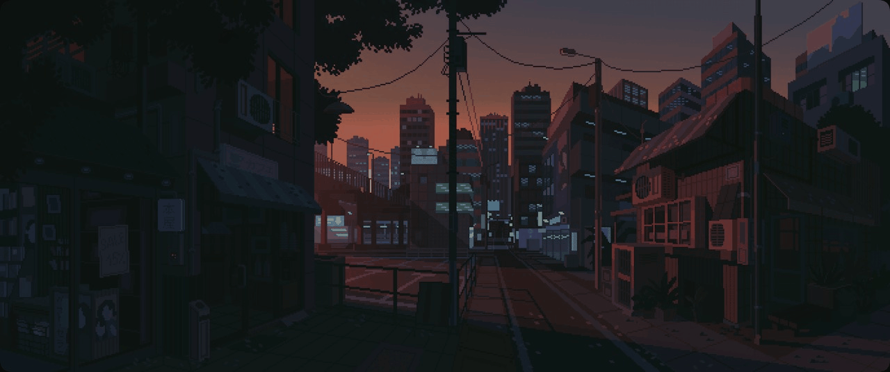

<div align="center">
  
</div>

```python
# You can use this code in your IDE.
class ReversalReside:
    def __init__(self):
        self.name = "Егор Мостренов"
        self.nick = "ReversalReside"
        self.age = 17
        self.birthplace = "с.Смоленск, Алтайский край"
        self.stacks = ["Python", "JS", "Java", "Rust", "C++"]
        self.traits = {"выгорание": "быстрое", "софтскилы": "коммуникабельный", "мотивация": "ленивый"}
        self.links = {"portfolio": "https://ReversalReside.code", "tg": "@Vu4erk"}
        
    def code(self, task):
        if self.traits["мотивация"] == "ленивый":
            print(f"{self.nick}: *звуки выгорания на {self.stacks[0]}*")
            return "Потом допишу (никогда)"
        return f"Фигачим {task} на {', '.join(self.stacks[:3])}"

dev = ReversalReside()
print(f"{dev.name}, {dev.age} лет, родился в {dev.birthplace}")
print(f"ТГ: {dev.links['tg']} | Портфолио: {dev.links['portfolio']}")
print(dev.code("бот")) 
```
---
###### <div align="center">Soon here can be matrix (statics.)</div>
